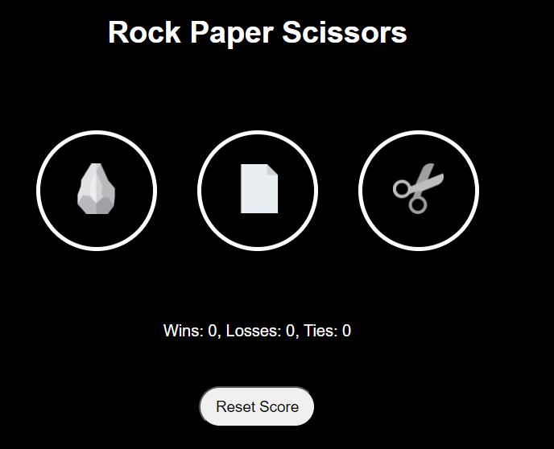

# Rock Paper Scissors Game

Welcome to my Rock Paper Scissors game! This is a simple web-based game that allows you to play Rock, Paper, Scissors against the computer. I built this project while learning JavaScript basics and following a tutorial video. I have updated and customized the code based on my understanding and creativity.
You can watch the tutorial [here](https://www.youtube.com/watch?v=EerdGm-ehJQ).
## Live Demo

<!-- You can try the game live [here](https://your-live-demo-link.com). -->

## Features

- Player can choose their ooption
- Reset Score Option
- Refreshing doesnt delete the scores
- Added Auto Play option 

## Screenshot




## How to Play

1. Choose your move: Rock, Paper, or Scissors.
2. -You can Press : 
      2.1- r or 1 key for Rock
      2.2- p or 2 for Paper
      2.3- s or 3 for Scissor, to play.
3. The computer will randomly choose its move.
4. The winner is determined by the standard rules:
   - Rock beats Scissors
   - Scissors beats Paper
   - Paper beats Rock

## Getting Started

To run this project locally, follow these steps:

1. Clone the repository:
    ```bash
    git clone https://github.com/ziyadkadekara/rock-paper-scissors.git
    ```
2. Navigate to the project directory:
    ```bash
    cd rock-paper-scissors
    ```
3. Open `index.html` in your favorite web browser.

## Technologies Used

- HTML
- CSS
- JavaScript

## Acknowledgements

This project was inspired by [SuperSimpleDev tutorial](https://www.youtube.com/watch?v=EerdGm-ehJQ). I have made some modifications 

## Contributing

If you have any suggestions or improvements, feel free to submit a pull request or open an issue.

